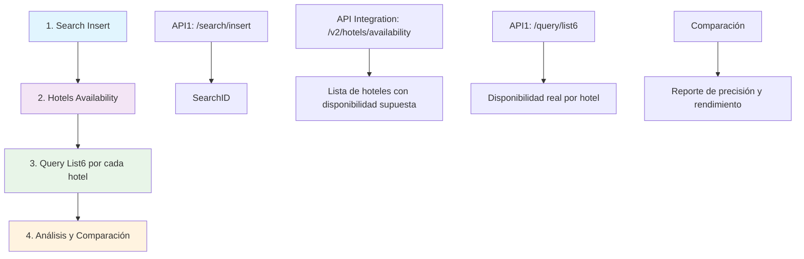

# 🏨 Hotel Availability Flow Testing Framework

Framework de testing escalable para validar flujos completos entre APIs de disponibilidad hotelera. Diseñado para comparar la precisión entre la disponibilidad supuesta y la disponibilidad real de hoteles, así como medir el rendimiento entre diferentes entornos.

## 📋 Descripción del Flujo

El framework ejecuta un flujo completo que simula el comportamiento del usuario final:



### Flujo Detallado

1. **Search Insert (API1)**: Registra una búsqueda con parámetros de ubicación y fechas, retorna un `SearchID`
2. **Hotels Availability (API Integration)**: Consulta hoteles con disponibilidad supuesta usando el `SearchID`
3. **Query List6 (API1)**: Para cada hotel con disponibilidad supuesta, verifica la disponibilidad real de habitaciones
4. **Análisis**: Compara disponibilidad supuesta vs real y genera métricas de precisión

## 🚀 Instalación y Configuración

### Prerrequisitos

- Node.js 18+ 
- npm o yarn
- Acceso a las APIs de PXSOL

### Instalación Rápida

```bash
# Clonar o descargar el proyecto
cd hotel-availability-testing

# Instalación automática
npm run setup
```

### Instalación Manual

```bash
# Instalar dependencias
npm install

# Compilar TypeScript
npm run build

# Ejecutar tests
npm test
```

### Configuración

1. Copia el archivo de configuración:
```bash
cp .env-example .env
```

2. Configura las variables de entorno en `.env`:
```env
# Environment Configuration
NODE_ENV=development

# API Endpoints - Development
DEV_API1_BASE_URL=https://api-1-testing.pxsol.com
DEV_API_INTEGRATION_BASE_URL=https://gateway-dev.pxsol.com

# API Endpoints - Production  
PROD_API1_BASE_URL=https://api-1-eb-web.pxsol.io
PROD_API_INTEGRATION_BASE_URL=https://gateway-prod.pxsol.com

# Authentication Tokens
AUTHORIZATION_API_INTEGRATION="Bearer 114|LuhhnXez3aq5tl9CGzdBH0NoNLA4HkMg9777vD5Nc5926620"
# PXSOL_AUTH_TOKEN=your_pxsol_auth_token_here

# Search Parameters
SEARCH_LATITUDE=-34.6036739
SEARCH_LONGITUDE=-58.3821215
SEARCH_DISTANCE_RADIUS=50000
SEARCH_LOCATION_NAME="Buenos Aires, Ciudad Autónoma de Buenos Aires, Argentina"
SEARCH_START_DATE=30
SEARCH_END_DATE=32

# Test Configuration
DEFAULT_TIMEOUT=30000
MAX_RETRIES=3
MAX_HOTELS_TO_TEST=5
MAX_PAGES_TO_SCAN=10
CONCURRENT_REQUESTS=5

# Logging
LOG_LEVEL=info
LOG_FILE=logs/test-results.log
```

**Importante**: 
- El token `AUTHORIZATION_API_INTEGRATION` es requerido para acceder a la API Integration
- `MAX_HOTELS_TO_TEST` controla cuántos hoteles se testean (por defecto 5 para rapidez)
- `MAX_PAGES_TO_SCAN` limita cuántas páginas de la API Integration escanear (por defecto 10)
- Los parámetros `SEARCH_*` permiten configurar la ubicación y fechas de búsqueda dinámicamente

## 🎯 Uso

### Comandos Principales

```bash
# Test en desarrollo
npm run dev

# Test en producción  
npm run prod

# Test comparativo entre entornos
npm run compare

# Ejemplo completo
npm run example

# Ayuda
npm run start help
```

### Uso como API REST

El framework también puede ejecutarse como un API REST.

1. Levantar el servidor:
```bash
npm run serve-api
```

2. Endpoint de salud:
```bash
GET /health
```

3. Ejecutar el flujo completo:
```bash
GET /api/flow?env=production&latitude=-32.8894587&longitude=-68.8458386&distance_radius=30000&start_days=30&end_days=32&token=Bearer%20TU_TOKEN
```

o vía POST:
```http
POST /api/flow
Content-Type: application/json

{
  "env": "production",
  "latitude": -32.8894587,
  "longitude": -68.8458386,
  "distance_radius": 30000,
  "start_days": 30,
  "end_days": 32,
  "token": "Bearer TU_TOKEN"
}
```

Notas:
- Formato de fechas generado: YYYY-MM-DD (por ejemplo 2025-09-11 → 2025-09-13)
- `token` es opcional. Si se provee, reemplaza `AUTHORIZATION_API_INTEGRATION` del entorno.
- Respuesta incluye el resultado del test y rutas de reportes.

### Uso Programático

```typescript
import { HotelAvailabilityTestService, ReportingService } from './src';
import { getEnvironment } from './src/config/environments';
import { generateTestDates } from './src/utils/dateHelper';

// Configurar test
const config = {
  environment: getEnvironment('development'),
  searchParams: {
    latitude: -34.6036739,
    longitude: -58.3821215,
    distance_radius: 50000,
    location_search: 'Buenos Aires, Argentina',
    ...generateTestDates(30, 2) // 30 días desde hoy, 2 noches (YYYY-MM-DD)
  },
  maxHotelsToTest: 5,
  timeout: 30000
};

// Ejecutar test
const testService = new HotelAvailabilityTestService(config);
const result = await testService.runCompleteFlowTest();

// Generar reportes
const reportingService = new ReportingService();
await reportingService.saveTestResult(result);
await reportingService.generateTextReport(result);
```

## 📊 Reportes y Métricas

El framework genera varios tipos de reportes:

### 1. Reporte JSON Completo
```json
{
  "testId": "development_1704067200000_abc123",
  "environment": "development",
  "timestamp": "2024-01-01T00:00:00.000Z",
  "duration": 15000,
  "searchInsert": {
    "success": true,
    "duration": 1200,
    "searchId": 46322997
  },
  "hotelsAvailability": {
    "success": true,
    "duration": 3500,
    "hotelsCount": 25,
    "availableHotelsCount": 15
  },
  "comparison": {
    "totalHotelsFromAvailability": 25,
    "hotelsWithSupposedAvailability": 15,
    "hotelsTestedInList6": 15,
    "hotelsWithRealAvailability": 12,
    "accuracyPercentage": 80,
    "discrepancies": [...]
  }
}
```

### 2. Reporte de Texto
```
Test Summary - DEVELOPMENT
=====================================
Test ID: development_1704067200000_abc123
Duration: 15000ms
Timestamp: 2024-01-01T00:00:00.000Z

Search Insert: ✅ (1200ms)
Hotels Availability: ✅ (3500ms)

Hotels Analysis:
- Total hotels returned: 25
- Hotels with supposed availability: 15
- Hotels tested in list6: 15
- Hotels with real availability: 12
- Accuracy: 80%

Discrepancies: 3
- Hotel ABC (ID: 12724): Supposed=2, Real=false, Rates=0
- Hotel XYZ (ID: 15623): Supposed=1, Real=false, Rates=0
```

### 3. Reporte CSV para Análisis
Incluye métricas clave para análisis en Excel/Google Sheets.

### 4. Reporte Comparativo entre Entornos
Compara métricas de desarrollo vs producción.

## 🏗️ Arquitectura

```
src/
├── types/           # Definiciones TypeScript
├── config/          # Configuración de entornos y logging
├── clients/         # Clientes HTTP para APIs
├── services/        # Servicios principales
├── utils/           # Utilidades y helpers
├── tests/           # Tests unitarios
└── index.ts         # Punto de entrada principal

scripts/             # Scripts de automatización
reports/             # Reportes generados
logs/                # Archivos de log
```

### Componentes Principales

- **HotelAvailabilityTestService**: Orquesta el flujo completo de testing
- **Api1Client**: Cliente para API1 (search/insert, query/list6)
- **ApiIntegrationClient**: Cliente para API Integration (hotels/availability)
- **ReportingService**: Generación de reportes y métricas
- **Logger**: Sistema de logging estructurado

## 🧪 Testing

```bash
# Ejecutar todos los tests
npm test

# Tests en modo watch
npm run test:watch

# Coverage report
npm run test:coverage

# Linting
npm run lint
npm run lint:fix
```

## 📈 Métricas Clave

El framework mide:

- **Precisión**: % de hoteles con disponibilidad real vs supuesta
- **Rendimiento**: Tiempo de respuesta de cada endpoint
- **Disponibilidad**: Tasa de éxito de las APIs
- **Discrepancias**: Hoteles con disponibilidad supuesta pero sin disponibilidad real

## 🔧 Configuración Avanzada

### Personalizar Búsquedas

**Opción 1: Variables de Entorno (Recomendado)**
```bash
# Cambiar ubicación a Madrid
SEARCH_LATITUDE=40.4168
SEARCH_LONGITUDE=-3.7038
SEARCH_DISTANCE_RADIUS=25000
SEARCH_LOCATION_NAME="Madrid, España"
SEARCH_START_DATE=15  # En 15 días
SEARCH_END_DATE=17    # En 17 días (2 noches)

npm run dev
```

**Opción 2: Script de Ubicaciones Predefinidas**
```bash
# Cambiar rápidamente a ubicaciones comunes
./scripts/set-location.sh madrid
./scripts/set-location.sh newYork
./scripts/set-location.sh london

# Ver ubicaciones disponibles
./scripts/set-location.sh
```

**Opción 3: Variables Temporales**
```bash
# Test temporal en París
SEARCH_LATITUDE=48.8566 SEARCH_LONGITUDE=2.3522 npm run dev
```

### Limitar Hoteles Testeados

**Opción 1: Variable de Entorno (Recomendado)**
```bash
# En .env
MAX_HOTELS_TO_TEST=15  # Testear 15 hoteles

# O directamente al ejecutar
MAX_HOTELS_TO_TEST=20 npm run dev
```

**Opción 2: Código**
```typescript
const config = {
  // ...otros parámetros
  maxHotelsToTest: 10, // Testear solo los primeros 10 hoteles
};
```

### Configurar Timeouts y Reintentos

```typescript
const config = {
  // ...otros parámetros
  timeout: 45000,  // 45 segundos
  retries: 5       // 5 reintentos
};
```

## 🚨 Troubleshooting

### Problemas Comunes

1. **Error de conexión**: Verificar URLs de APIs en `.env`
2. **Timeout**: Aumentar `timeout` en configuración
3. **Sin resultados**: Verificar parámetros de búsqueda (fechas futuras, ubicación válida)
4. **Permisos**: Verificar tokens de autenticación si son requeridos

### Debug Mode

```bash
# Habilitar logs debug
LOG_LEVEL=debug npm run dev
```

### Logs

Los logs se guardan en:
- `logs/test-results.log` - Logs generales
- `logs/error.log` - Solo errores

## 🤝 Contribución

Para agregar nuevos tests o funcionalidades:

1. Crear nuevos tipos en `src/types/`
2. Implementar servicios en `src/services/`
3. Agregar tests en `src/tests/`
4. Actualizar documentación

### Estructura de un Nuevo Test

```typescript
export class NewFlowTestService {
  async runTest(): Promise<TestResult> {
    // 1. Validar parámetros
    // 2. Ejecutar flujo
    // 3. Analizar resultados
    // 4. Retornar métricas
  }
}
```

## 📝 Changelog

### v1.0.0
- ✅ Flujo completo search/insert → hotels/availability → query/list6
- ✅ Comparación entre entornos desarrollo/producción
- ✅ Sistema de reportes JSON, texto y CSV
- ✅ Logging estructurado
- ✅ Tests unitarios
- ✅ CLI interactiva

## 📄 Licencia

MIT License - ver archivo LICENSE para detalles.

---

**Desarrollado por PXSOL Development Team** 🚀