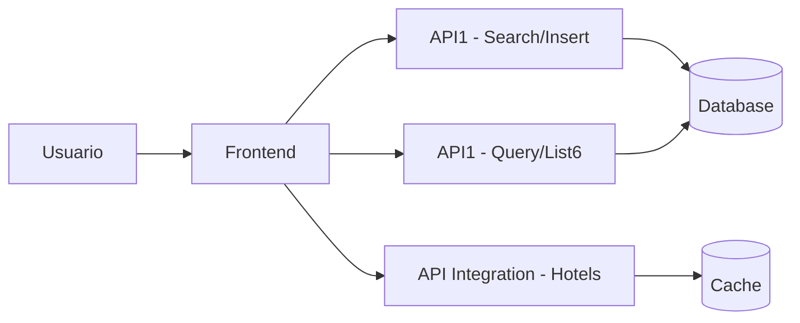

# 📋 Documentación Técnica del Flujo de Disponibilidad Hotelera

## Resumen Ejecutivo

Este documento describe el flujo completo de disponibilidad hotelera implementado en el framework de testing. El flujo simula el comportamiento real del usuario al buscar hoteles y verificar disponibilidad.

## 🔄 Flujo de la Aplicación

### Vista General del Sistema



### Flujo Paso a Paso

#### 1. Registro de Búsqueda (Search Insert)

**Endpoint**: `POST /search/insert` (API1)

**Propósito**: Registrar una nueva búsqueda de hotel y obtener un identificador único.

**Datos de Entrada**:
```json
{
  "latitude": -34.6036739,
  "longitude": -58.3821215,
  "distance_radius": 50000,
  "location_search": "Buenos Aires, Argentina",
  "Start": "24/09/2025",
  "End": "26/09/2025",
  "PartyType": "double",
  "MaxRooms": 2,
  "Nights": 1,
  "Currency": "USD",
  "Pos": "ROOMFARES"
}
```

**Respuesta Clave**:
```json
{
  "SearchID": 46322997,
  "Response": 1,
  "Currency": "USD",
  "latitude": "-34.6036739",
  "longitude": "-58.3821215"
}
```

**Validaciones**:
- Coordenadas válidas
- Fechas futuras
- Formato de fecha DD/MM/YYYY
- Radio de búsqueda > 0

#### 2. Consulta de Disponibilidad Multi-Hotel (Hotels Availability)

**Endpoint**: `GET /v2/hotels/availability` (API Integration)

**Propósito**: Obtener lista paginada de hoteles con disponibilidad supuesta (cacheada).

**Parámetros**:
```
search_definition_id=46322997
currency=USD
lat=-34.6036739
lng=-58.3821215
distance_radius=50000
search_type=lat_lng
pos=ROOMFARES
order_by=distance
current_page=1
```

**Respuesta Estructura**:
```json
{
  "data": {
    "hotels": [
      {
        "hotel_id": 12724,
        "name": "Broadway Hotel & Suites",
        "availability": 2,
        "latitude": -34.60369,
        "longitude": -58.38329,
        "distance_from_search_coordinate": 106.96
      }
    ]
  }
}
```

**Criterios de Filtrado**:
- `availability > 0`: Hotel con disponibilidad supuesta
- Ordenado por distancia por defecto
- Respuesta cacheada para performance

**Paginación**:
- La API retorna máximo 50 hoteles por página
- El framework escanea automáticamente múltiples páginas
- Configurable con `MAX_PAGES_TO_SCAN` (por defecto 10 páginas)
- Información de paginación en `meta.total_pages` y `meta.total_hotels`

#### 3. Verificación de Disponibilidad Real (Query List6)

**Endpoint**: `GET /query/list6` (API1)

**Propósito**: Verificar disponibilidad real de habitaciones para un hotel específico.

**Parámetros**:
```
search=OK
pos=ROOMFARES
lng=en
SearchID=46322997
ProductID=12724
Sku=1
Currency=USD
Email=NN
Tag=PmsLink
order_rooms=recommended
```

**Respuesta Crítica - SkuList**:
```json
{
  "ProductList": [
    {
      "SkuList": [
        {
          "SkuID": 50337,
          "Title": "Corner",
          "RateList": [
            {
              "ID": 26178,
              "Name": "HYPERGUEST BB ARG",
              "Availability": 3,
              "RatePerDay": {
                "a0_c0": {
                  "rates_per_day": [
                    {
                      "availability": 3,
                      "rate": 114.95
                    }
                  ]
                }
              }
            }
          ]
        }
      ]
    }
  ]
}
```

**Validación de Disponibilidad Real**:
```typescript
// Un hotel tiene disponibilidad real si:
const hasRealAvailability = skuList.some(sku => 
  sku.RateList.some(rate => rate.Availability > 0)
);
```

## 📊 Análisis y Métricas

### Métricas Calculadas

1. **Precisión de Disponibilidad**:
   ```
   Precisión = (Hoteles con disponibilidad real / Hoteles testeados exitosamente) * 100
   ```
   
   **Importante**: La precisión se calcula sobre los hoteles que fueron efectivamente testeados,
   no sobre el total de hoteles con disponibilidad supuesta. Esto da una métrica más precisa
   del rendimiento del sistema en la muestra analizada.

2. **Rendimiento por Endpoint**:
   - Tiempo de respuesta Search Insert
   - Tiempo de respuesta Hotels Availability
   - Tiempo promedio Query List6

3. **Discrepancias**:
   - Falsos positivos: Disponibilidad supuesta pero sin disponibilidad real
   - Falsos negativos: Sin disponibilidad supuesta pero con disponibilidad real (no aplicable en este flujo)

### Casos de Discrepancia

#### Falso Positivo
```json
{
  "hotelId": 12724,
  "hotelName": "Broadway Hotel & Suites",
  "supposedAvailability": 2,
  "realAvailability": false,
  "availableRates": 0
}
```

**Causas Posibles**:
- Cache desactualizado en Hotels Availability
- Reservas realizadas entre consultas
- Diferencias en lógica de disponibilidad entre sistemas
- Problemas de sincronización de inventario

#### Disponibilidad Confirmada
```json
{
  "hotelId": 15623,
  "hotelName": "Hotel Example",
  "supposedAvailability": 1,
  "realAvailability": true,
  "availableRates": 3
}
```

## 🔍 Puntos Críticos de Validación

### 1. Consistencia de SearchID
- El SearchID debe ser válido en ambas APIs
- Timeout de SearchID (típicamente 24 horas)

### 2. Sincronización de Inventario
- Hotels Availability usa cache para performance
- Query List6 accede a datos en tiempo real
- Ventana de inconsistencia esperada: 5-15 minutos

### 3. Lógica de Disponibilidad
```typescript
// Hotels Availability
hotel.availability > 0

// Query List6  
sku.RateList.some(rate => rate.Availability > 0)
```

### 4. Parámetros de Búsqueda
- Coordenadas deben ser consistentes
- Fechas deben mantenerse iguales
- Currency debe ser la misma

## 🚨 Escenarios de Error Comunes

### 1. SearchID Expirado
```json
{
  "error": "Search definition not found",
  "searchId": 46322997
}
```

### 2. Hotel No Disponible
```json
{
  "ProductList": [],
  "ProductID": 12724
}
```

### 3. Timeout de API
```
Error: Request timeout after 30000ms
```

### 4. Rate Limit
```
Error: Too many requests (429)
```

## 📈 Interpretación de Resultados

### Rangos de Precisión Esperados

- **Excelente**: >95% - Sistema altamente sincronizado
- **Bueno**: 85-95% - Sincronización aceptable con diferencias menores de cache
- **Regular**: 70-85% - Posibles problemas de sincronización
- **Problemático**: <70% - Requiere investigación técnica

### Factores que Afectan la Precisión

1. **Temporales**:
   - Hora del día (mayor actividad = mayor cambio)
   - Día de la semana
   - Temporada alta/baja

2. **Técnicos**:
   - Frecuencia de actualización de cache
   - Latencia entre sistemas
   - Procesos de sincronización

3. **Comerciales**:
   - Políticas de overbooking
   - Reservas de último momento
   - Bloqueos por mantenimiento

## 🔧 Optimizaciones Recomendadas

### 1. Reducir Falsos Positivos
- Disminuir TTL del cache en Hotels Availability
- Implementar invalidación proactiva de cache
- Sincronización en tiempo real para hoteles críticos

### 2. Mejorar Performance
- Paralelizar consultas Query List6
- Implementar circuit breaker para APIs lentas
- Cache inteligente basado en patrones de búsqueda

### 3. Monitoreo Continuo
- Alertas cuando precisión < 80%
- Métricas de latencia por endpoint
- Dashboard en tiempo real

## 📋 Checklist de Validación

### Pre-Test
- [ ] URLs de APIs configuradas correctamente
- [ ] Tokens de autenticación válidos
- [ ] Parámetros de búsqueda realistas
- [ ] Fechas futuras (>24 horas)

### Durante Test
- [ ] SearchID generado exitosamente
- [ ] Hotels Availability retorna resultados
- [ ] Al menos 1 hotel con availability > 0
- [ ] Query List6 ejecuta sin errores

### Post-Test
- [ ] Precisión calculada correctamente
- [ ] Discrepancias documentadas
- [ ] Reportes generados
- [ ] Logs sin errores críticos

---

Esta documentación debe actualizarse cuando se modifiquen las APIs o se identifiquen nuevos patrones en los datos.